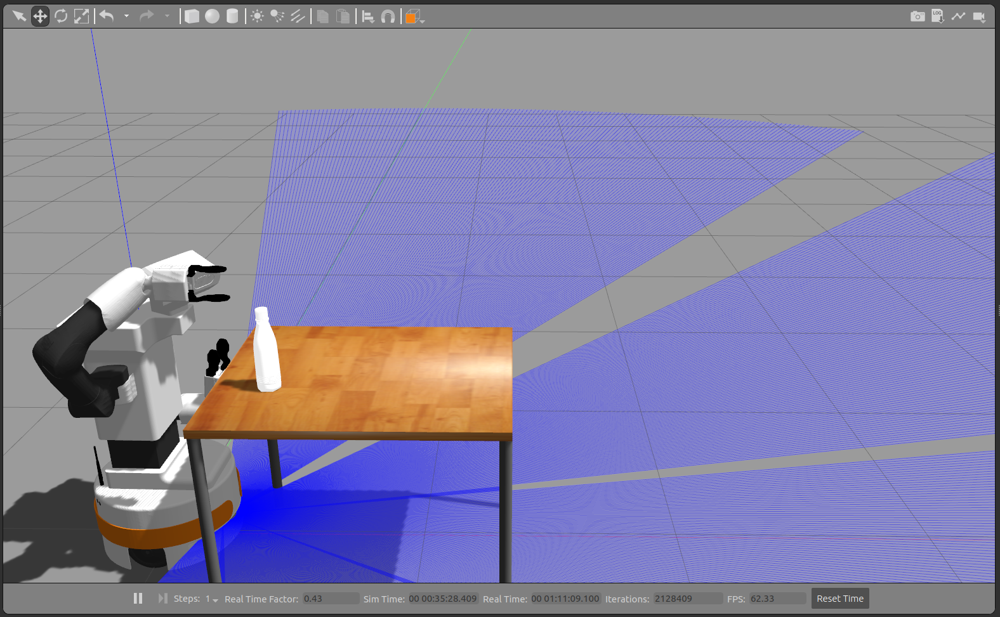

# Grasp generator

:warning: **This repository is still under development! Using is at own risk**

This readme file contains the final work of S. Zwinkels. It requires some additional third party packages. The code forms a block into a bigger pipeline to grasp complex products in different orientations.


This readme file contains an explanation to launch the antipodal grasp sampler. It requires to perceive a point-cloud in the ```sensor_msgs/PointCloud2``` message type. The folder contains a server/client connection to send point clouds and retrieve grasp poses. 

The following steps can be taken to get a similar setup:

## 1) Installation
1. Install GPD. You can follow [these instructions](https://github.com/atenpas/gpd#install). Make sure to run `make install` to install GPD as a library.

To make the software work on your system, you need to modify the config file in your `gpd` folder, e.g., 
`<path_to_gpd>/cfg/ros_eigen_params.cfg`. Search for parameters that have 
absolute file paths and change them to actual paths on your system.

Next, you need to modify the path in the ROS launch file that points to the 
config file that you changed in the previous step. Now, you can run GPD as a ROS server. The following commands will launch the simulation correctly. 

2. Install knowrob and rosprolog. Follow the following tutorial [these instructions](https://github.com/knowrob/knowrob). Make sure to install the correct prerequisites (ROS, SWI-PROLOG, mongo DB Server, rosprolog).  

3. This repository makes use of the TIAGo robot for grasping products. Install tiago with [these instructions](https://github.com/pal-robotics/tiago_robot).

4. Clone this repository into the `src` folder of your catkin workspace:
   ```
   cd <location_of_your_workspace>/src
   git clone git@github.com:stanzwinkels/grasp_generator.git
   ```
   
3. Build your catkin workspace:

   ```
   cd <location_of_your_workspace>
   catkin_make
   ```

## 2) Launching TIAGo

1. Source the World environment and dependencies:

```
roscd retail_store_simulation
source scripts/set_gazebo_env.sh
```

```
cd ~
source /opt/ros/melodic/setup.zsh
source ~/<install_folder>/devel/setup.zsh
```

2. Activate mongoDB service:
```
sudo service mongod start
```

3. Launch all servers. This launch file launches knowrob, GPD, rosprolog, and the additional servers.  
```
roslaunch grasp_generator grasp_world.launch
```


4. Before running the script, the user should manually add a table and place an object in front of TIAGo, as shown below:



5. To make tiago perform an action run for reasoning version-1: 
```
rosrun grasp_generator SPaRGE_version1.py
```
or for reasoning version-2:
```
rosrun grasp_generator SPaRGE_version2.py
```


# 3) Other experiments
Other experiments can be found in the following files: 

```
data_generation.py                     Generation dataset partial object point clouds
data_generation_semantics.py           Generation dataset primitive shapes
shape_classification.ipynb             Training machine learning models primitive shapes
shape_optimalisation.py                Hyperparameter tuning superquadric algorithm 
shape_optimalisation_real_object.py    Hyperparameter tuning superquadric algorithm real world
```
